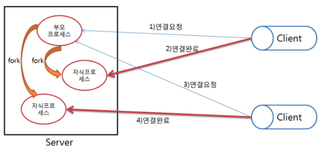
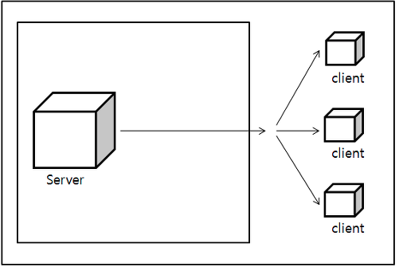
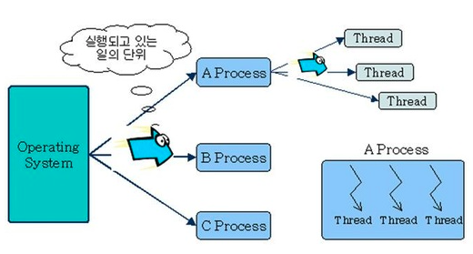
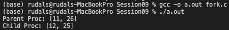

## Multi access server란
: 둘 이상의 클라이언트에게 동시에 서비스를 제공하는 방식

Multi access server의 종류
1. Multi-process based server
    : 다수의 프로세스를 생성하는 방식으로 서비스를 제공
2. Multiplexing based server
    : 입출력 대상을 묶어서 관리하는 방식으로 서비스를 제공
3. Multi-thread based server
    : 클라이언트의 수만큼 쓰레드를 생성하는 방식으로 서비스를 제공

</img> 

### 프로세스 기반 다중 접속 서버) -> Session9, 10
1. 연결이 하나 생성될 때마다 프로세스를 생성해서 해당 클라이언트에 대해 서비스를 제공하는 것
2. 부모 프레세스는 accept 함수호출을 통해서 연결 요청을 받고, 이때 얻게 되는 소켓의 파일 디스크립터를 자식 프로세스를 생성해서 준다.
3. 자식 프로세스는 전달받은 파일 디스크립터를 바탕을 서비스를 제공한다.
4. 주의할 점은 프로세스가 복사되는 경우 해당 프로세스에 의해 만들어진 소켓이 복사되는 것이 아니고, 파일 디스크립터가 복사된다.
5. 하나의 소켓에 두 개의 파일 디스크립터가 존재하는 경우, 두 파일 디스크립터 모두 종료되어야 해당 소켓 소멸
6. 항상 fork함수 호출 후에는 서로에게 상관없는 파일 디스크립터를 종료한다

단점)    멀티 프로세스 서버는 클라이언트 연결요청이 있을 때마다, 새로운 프로세스를 생성하는 기법으로, 상당히 많은 양의 연산이 요구되고
        필요한 메모리 공간도 비교적 큰 편이다

</img> 

### 멀티 플렉싱 기반 다중 접속 서버) -> Session12
1. 프로세스의 생성을 동반하지 않고, 다수의 클라이언트들에게 서비스를 제공할 수 있는 방법
2. 멀티 플렉싱은 물리적 장치의 효율성을 높이기 위해 최소한의 물리적인 요소만 사용해서 최대한의 데이터를 전달하기 위해 사용하는 기술이다.
3. 기존의 자식 프로세스를 생성해서 서비스를 하는 멀티프로세스 서버와는 달리 자식 프로세스가 각각의 소켓을 처리하는게 아니고, 서버하나가 각각의 소켓에 대한 서비스를 제공하는 개념
4. 주로 송수신이 연속적이지 않는 상황, 송수신 데이터 용량이 적은 경우, 많은 수의 클라이언트 처리에 적합하다.
5. 대표적인 함수로는 select, epoll 시스템 함수가 있다

** I/O Multiplexing 매커니즘 **
입출력 이벤트를 검사할 파일의 정보를 가지는 비트 테이블을 준비
비트 테이블에 검사할 파일에 체크
체크한 파일에 이벤트가 발생하면, 이벤트가 발생한 비트 필드의 값을 1로 해서 반환
비트 테이블을 검사. 비트 필드가 1이면, 이에 대응하는 파일에 대해서 입출력 함수를 호출

</img> 
마땅한 쓰레드 서버에 대한 그림이 없어서 쓰레드에 대한 그림을 가지고 왔다

### 멀티 쓰레드 기반 다중 접속 서버) -> Session14, 15
1. 멀티 프로세스와 마찬가지로 동시 실행이 가능하다
2. 서버에서 클라이언트가 접속할 때마다 스레드를 하나 만들어주는 방식
3. 쓰레드는 light weight proces로 가볍고, 일부 메모리를 공유하므로 스레드간 통신이 편리하다
4. 공통변수에 대한 임계구역문제(critical section)문제를 잘 다루어 주어야한다

</img> 
fork.c 에서는 fork 함수를 호출했을 때 각 변수가, 즉 메모리가 공유되는지를 알아보았다. 분리된 메모리 구조를 지님을 알 수 있다.

wait.c 에서는 두개의 자식 프로세스가 좀비 프로세스가 되지 않도록 하는 코드이다. parent에서 wait()함수를 호출하여 child process가 끝날 때 까지 기다리고 리턴 값을 찍는다.
wait 함수가 호출된 시점에서 종료된 자식 프로세스가 없다면, 임의의 자식프로세스가 종료될 때 까지 블로킹(blocking) 상태에 놓이게 된다

waitpid.c는 wait함수와 같이 좀비 프로세스의 생성을 막아주고 또한 wait 함수의 블로킹 문제를 해결해준다. 
option으로 WNOHANG를 넣어줌으로써 non-blocking 함수로 설정해주었다.
