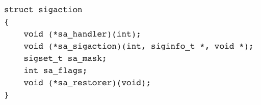

## Signal 이란
signal 이란 말 그대로 event가 발생하면 운영체제가 프로세스에게 알림을 보내는 것이라고 할 수 있다.
대표적 예를 들어, 프로그램이 돌아가고 있을 떄 ctrl+c, ctrl+z 을 눌러서 프로그램을 강제 종료하는 것
특정 시그널이 들어왔을 때 인터럽트가 발생하여 운영체제가 하던 작업을 멈추고 시그널에 대한 핸들링을 해주게 된다

- 시그널은 여러가지 종류가 있고 각각에 유일한 번호가 붙여져 있다

</img>     

sigaction, signal을 통하여서 설정이 가능하다 (signal 함수는 유닉스 계열의 운영체제 별로 동작방식에 있어서 차이를 보일 수 있지만, sigaction 함수는 차이즐 보이지 않는다)

### Sigaction
1. sigaction() 시스템 호출은 특정 시그널의 수신에 대해서 취할 액션을 설정하거나 변경하기 위해서 사용된다.
2. signum는 시그널을 명시한다. SIGKILL과 SIGSTOP를 제외한 모든 시그널이 타당한 시그널이 될 수 있다.
3. 만약 act가 null이 아니라면 signum번호를 가지는 시그널에 대해서 act함수가 설치된다. 만약 oldact가 null이 아니라면 이전의 액션은 oldact에 저장된다.

</img>    

###### sa_handler
signum번호를 가지는 시그널이 발생했을 때 실행된 함수를 설치한다. 함수외에도 SIG_DFL과 SIG_IGN을 지정할 수 있다. 전자는 시그널에 대한 기본행동을 후자는 시그널을 무시하기 위해서 사용한다.

###### sa_mask
sa_handler에 등록된 시그널 핸들러 함수가 실행되는 동안 블럭되어야 하는 시그널의 마스크를 제공한다. SA_NOMASK가 적용되어 있지 않다면

###### sa_flags
시그널 처리 프로세스의 행위를 수정하는 일련의 플래그들을 명시한다. 다음중 하나 이상의 것들에 의해서 만들어 진다.

#### <결과>
- echo_mpclient의 write_routine함수에서 q또는 Q가 발생하면 shutdown 함수를 통하여 소켓의 write 버퍼를 끊는다. 그렇게 되면 echo_mpserv에서 read함수의 반복문을 빠져나오게 된다. 처음에 shutdown 함수가 왜 있는지 궁금했는데 이번 예제를 통하여서 어떻게 사용하는지 조금은 알 것 같은 느낌이 든다..

### fork 함수호출을 통한 파일 디스크립터의 복사

</img>    

1. echo_mpserv에서 fork함수를 통하여서 부모 프로세스가 가지고 있는 소켓(서버, 클라이언트)의 파일 디스크립터가 자식프로세스로 복사가 되었다. 소켓이 하나 더 만들어진 것이 아니라 파일 디스크립터가 복사되었다는 것을 기억하자
2. 위 그림과 같이 하나의 소켓에 두개의 파일 디스크립터가 존재하는 경우 두개의 파일 디스크립터가 모두 종료되어야만 소켓이 소멸될 수 있다. 자식 프로세스가 클라이언트와 연결되어 있는 소켓을 소멸하려고 해도 소멸되지 않고 계속 남아있게 된다.

</img>  

위와 같이 서로에게 상관이 없는 소켓의 파일 디스크립터를 닫아주어야 한다.